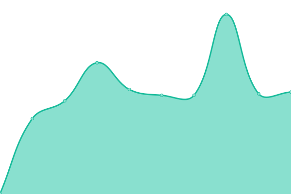

# [📈 Live Status](https://jimwib.github.io/uptime): <!--live status--> **🟩 All systems operational**

This repository contains the open-source uptime monitor and status page for [Jim Wiberley](http://www.staak.co.uk), powered by [Upptime](https://github.com/upptime/upptime).

With [Upptime](https://upptime.js.org), you can get your own unlimited and free uptime monitor and status page, powered entirely by a GitHub repository. We use [Issues](https://github.com/jimwib/uptime/issues) as incident reports, [Actions](https://github.com/jimwib/uptime/actions) as uptime monitors, and [Pages](https://jimwib.github.io/uptime) for the status page.

<!--start: status pages-->
<!-- This summary is generated by Upptime (https://github.com/upptime/upptime) -->
<!-- Do not edit this manually, your changes will be overwritten -->
<!-- prettier-ignore -->
| URL | Status | History | Response Time | Uptime |
| --- | ------ | ------- | ------------- | ------ |
|  [Staak](https://www.staak.co.uk) | 🟩 Up | [staak.yml](https://github.com/jimwib/uptime/commits/master/history/staak.yml) | 

 559ms
     
 | 

<a href="https://jimwib.github.io/uptime/history/staak">100.00%</a>
    

|  [Bleeding Edge](https://bleedingedge.com) | 🟩 Up | [bleeding-edge.yml](https://github.com/jimwib/uptime/commits/master/history/bleeding-edge.yml) | 

 1067ms
     
 | 

<a href="https://jimwib.github.io/uptime/history/bleeding-edge">100.00%</a>
    

|  [Bleeding Edge Forums](https://forum.bleedingedge.com) | 🟩 Up | [bleeding-edge-forums.yml](https://github.com/jimwib/uptime/commits/master/history/bleeding-edge-forums.yml) | 

 1489ms
     
 | 

<a href="https://jimwib.github.io/uptime/history/bleeding-edge-forums">100.00%</a>
    

|  [Monster](https://www.monsterhalopromotion.com) | 🟩 Up | [monster.yml](https://github.com/jimwib/uptime/commits/master/history/monster.yml) | 

 497ms
     
 | 

<a href="https://jimwib.github.io/uptime/history/monster">100.00%</a>
    

|  [Johnson Gibbs](https://johnsongibbs.co.uk) | 🟩 Up | [johnson-gibbs.yml](https://github.com/jimwib/uptime/commits/master/history/johnson-gibbs.yml) | 

 962ms
     
 | 

<a href="https://jimwib.github.io/uptime/history/johnson-gibbs">100.00%</a>
    

|  [Gymbox](https://www.gymbox.com) | 🟩 Up | [gymbox.yml](https://github.com/jimwib/uptime/commits/master/history/gymbox.yml) | 

 466ms
     
 | 

<a href="https://jimwib.github.io/uptime/history/gymbox">100.00%</a>
    

|  [Haark Api](https://api.haark.app) | 🟩 Up | [haark-api.yml](https://github.com/jimwib/uptime/commits/master/history/haark-api.yml) | 

 528ms
     
 | 

<a href="https://jimwib.github.io/uptime/history/haark-api">100.00%</a>
    

|  [Ninja Theory](https://ninjatheory.com) | 🟩 Up | [ninja-theory.yml](https://github.com/jimwib/uptime/commits/master/history/ninja-theory.yml) | 

 808ms
     
 | 

<a href="https://jimwib.github.io/uptime/history/ninja-theory">100.00%</a>
    

|  [Ninja Theory Api](https://api.ninjatheory.com) | 🟩 Up | [ninja-theory-api.yml](https://github.com/jimwib/uptime/commits/master/history/ninja-theory-api.yml) | 

 856ms
     
 | 

<a href="https://jimwib.github.io/uptime/history/ninja-theory-api">100.00%</a>
    

<!--end: status pages-->

[**Visit our status website →**](https://jimwib.github.io/uptime)

## 📄 License

- Powered by: [Upptime](https://github.com/upptime/upptime)
- Code: [MIT](./LICENSE) © [Jim Wiberley](http://www.staak.co.uk)
- Data in the `./history` directory: [Open Database License](https://opendatacommons.org/licenses/odbl/1-0/)
