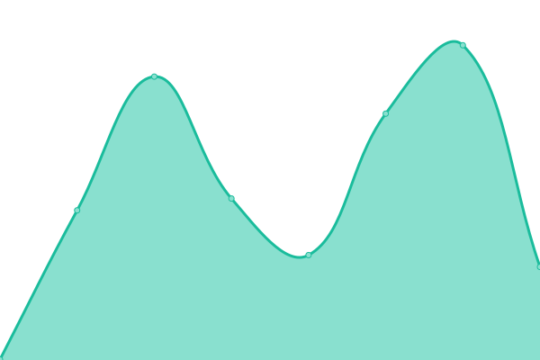
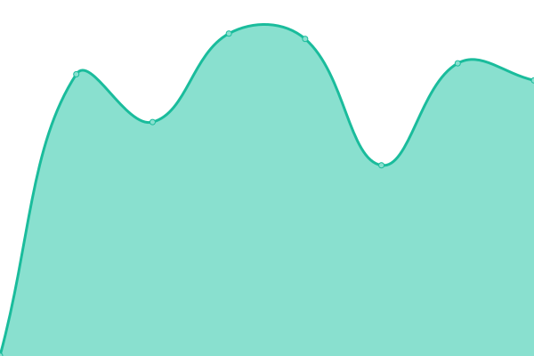
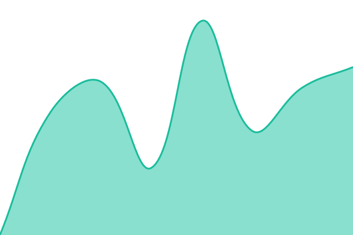
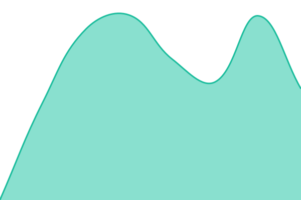
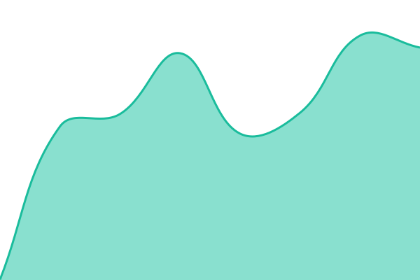

# [📈 Live Status](https://jimwib.github.io/uptime): <!--live status--> **🟧 Partial outage**

This repository contains the open-source uptime monitor and status page for [Jim Wiberley](http://www.staak.co.uk), powered by [Upptime](https://github.com/upptime/upptime).

With [Upptime](https://upptime.js.org), you can get your own unlimited and free uptime monitor and status page, powered entirely by a GitHub repository. We use [Issues](https://github.com/jimwib/uptime/issues) as incident reports, [Actions](https://github.com/jimwib/uptime/actions) as uptime monitors, and [Pages](https://jimwib.github.io/uptime) for the status page.

<!--start: status pages-->
<!-- This summary is generated by Upptime (https://github.com/upptime/upptime) -->
<!-- Do not edit this manually, your changes will be overwritten -->
<!-- prettier-ignore -->
| URL | Status | History | Response Time | Uptime |
| --- | ------ | ------- | ------------- | ------ |
|  [Staak](https://www.staak.co.uk) | 🟩 Up | [staak.yml](https://github.com/jimwib/uptime/commits/HEAD/history/staak.yml) | 

 312ms
     
 | 

<a href="https://jimwib.github.io/uptime/history/staak">100.00%</a>
    

|  [Bleeding Edge](https://bleedingedge.com) | 🟩 Up | [bleeding-edge.yml](https://github.com/jimwib/uptime/commits/HEAD/history/bleeding-edge.yml) | 

 1016ms
     
 | 

<a href="https://jimwib.github.io/uptime/history/bleeding-edge">100.00%</a>
    

|  [Bleeding Edge Forums](https://forum.bleedingedge.com) | 🟩 Up | [bleeding-edge-forums.yml](https://github.com/jimwib/uptime/commits/HEAD/history/bleeding-edge-forums.yml) | 

 1045ms
     
 | 

<a href="https://jimwib.github.io/uptime/history/bleeding-edge-forums">99.85%</a>
    

|  [Johnson Gibbs](https://johnsongibbs.co.uk) | 🟩 Up | [johnson-gibbs.yml](https://github.com/jimwib/uptime/commits/HEAD/history/johnson-gibbs.yml) | 

 1072ms
     
 | 

<a href="https://jimwib.github.io/uptime/history/johnson-gibbs">100.00%</a>
    

|  [Ninja Theory](https://ninjatheory.com) | 🟩 Up | [ninja-theory.yml](https://github.com/jimwib/uptime/commits/HEAD/history/ninja-theory.yml) | 

 679ms
     
 | 

<a href="https://jimwib.github.io/uptime/history/ninja-theory">100.00%</a>
    

|  [Ninja Theory WWW](https://www.ninjatheory.com) | 🟩 Up | [ninja-theory-www.yml](https://github.com/jimwib/uptime/commits/HEAD/history/ninja-theory-www.yml) | 

 749ms
     
 | 

<a href="https://jimwib.github.io/uptime/history/ninja-theory-www">100.00%</a>
    

|  [Ninja Theory Api](https://api.ninjatheory.com) | 🟩 Up | [ninja-theory-api.yml](https://github.com/jimwib/uptime/commits/HEAD/history/ninja-theory-api.yml) | 

 566ms
     
 | 

<a href="https://jimwib.github.io/uptime/history/ninja-theory-api">100.00%</a>
    

|  [Audiologic](https://www.audiologic.co.uk/news-and-insights) | 🟩 Up | [audiologic.yml](https://github.com/jimwib/uptime/commits/HEAD/history/audiologic.yml) | 

 1017ms
     
 | 

<a href="https://jimwib.github.io/uptime/history/audiologic">99.40%</a>
    

|  [Audiologic ie](https://www.audiologic.ie/news-and-insights) | 🟥 Down | [audiologic-ie.yml](https://github.com/jimwib/uptime/commits/HEAD/history/audiologic-ie.yml) | 

 0ms
     
 | 

<a href="https://jimwib.github.io/uptime/history/audiologic-ie">0.00%</a>
    

|  [Audiologic api](https://admin.audiologic.co.uk/api/articles) | 🟩 Up | [audiologic-api.yml](https://github.com/jimwib/uptime/commits/HEAD/history/audiologic-api.yml) | 

 622ms
     
 | 

<a href="https://jimwib.github.io/uptime/history/audiologic-api">99.41%</a>
    

|  [Bleeding Edge CMS](https://production-bleedingedge-cms.azurewebsites.net) | 🟩 Up | [bleeding-edge-cms.yml](https://github.com/jimwib/uptime/commits/HEAD/history/bleeding-edge-cms.yml) | 

 790ms
     
 | 

<a href="https://jimwib.github.io/uptime/history/bleeding-edge-cms">100.00%</a>
    

|  [Senuas Saga Home](https://senuassaga.com) | 🟩 Up | [senuas-saga-home.yml](https://github.com/jimwib/uptime/commits/HEAD/history/senuas-saga-home.yml) | 

 758ms
     
 | 

<a href="https://jimwib.github.io/uptime/history/senuas-saga-home">100.00%</a>
    

|  [Senuas Saga News](https://senuassaga.com/news) | 🟩 Up | [senuas-saga-news.yml](https://github.com/jimwib/uptime/commits/HEAD/history/senuas-saga-news.yml) | 

 2053ms
     
 | 

<a href="https://jimwib.github.io/uptime/history/senuas-saga-news">100.00%</a>
    

<!--end: status pages-->

[**Visit our status website →**](https://jimwib.github.io/uptime)

## 📄 License

- Powered by: [Upptime](https://github.com/upptime/upptime)
- Code: [MIT](./LICENSE) © [Jim Wiberley](http://www.staak.co.uk)
- Data in the `./history` directory: [Open Database License](https://opendatacommons.org/licenses/odbl/1-0/)
